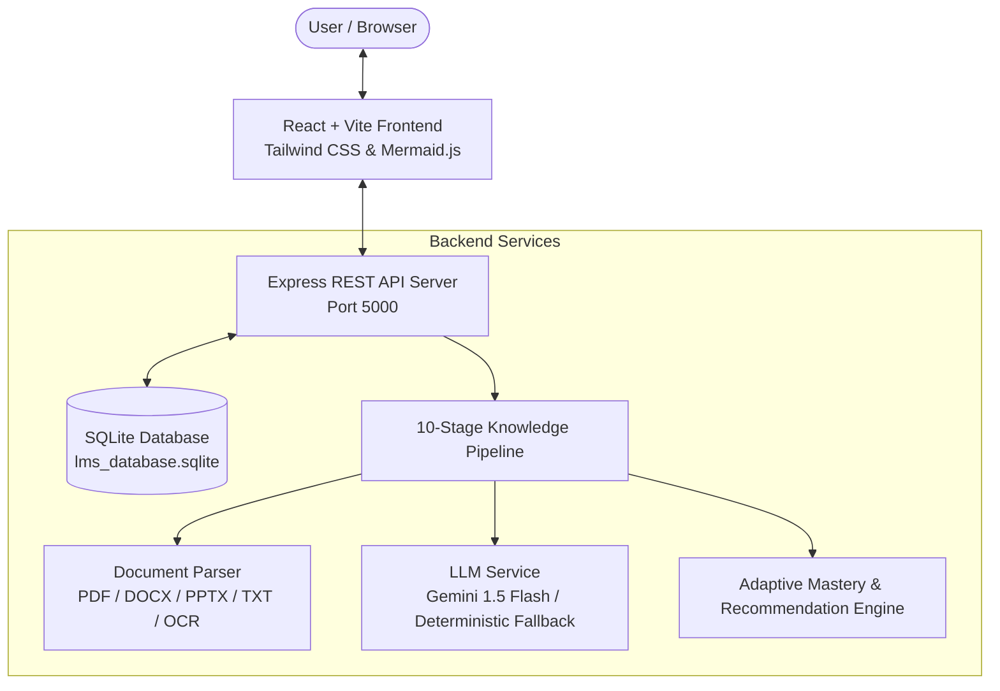
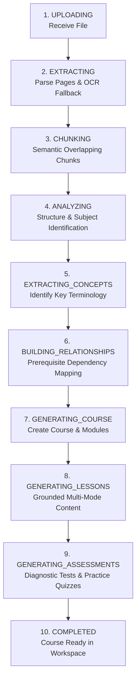
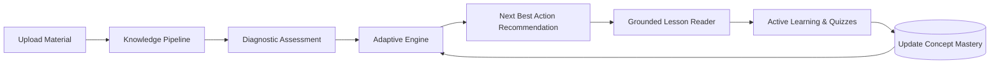

# 🧠 CogniFlow AI - Adaptive Learning Management System

> **Document Material → Dynamic Knowledge Graph → 10-Stage Pipeline → Personal Adaptive Mastery**

CogniFlow AI is an end-to-end, intelligent Adaptive Learning Management System (LMS) designed to convert unstructured study materials (PDF, DOCX, PPTX, TXT) into personalized, concept-grounded learning pathways.

---

## 🌟 Key Features

- 📄 **Multi-Format Material Ingestion**: Upload academic PDFs, Word documents, PowerPoint presentations, or raw text files with built-in OCR fallback.
- ⚡ **10-Stage Knowledge Extraction Pipeline**: Automatically extracts pages, performs semantic chunking, identifies key concepts, builds prerequisite relationships, and generates grounded diagnostic assessments.
- 🎓 **4-Mode Pedagogical Lesson Reader**: Switch seamlessly between:
  - **Simple Mode**: Beginner-friendly analogies, real-world examples, and step-by-step logic.
  - **Detailed Mode**: Comprehensive academic definitions and comparative analysis.
  - **Exam Mode**: High-yield exam definitions, model Q&A, and key equations.
  - **Deep Dive Mode**: Low-level hardware mechanics, internal architecture, and kernel execution flows.
- 🕸️ **Interactive Prerequisite Knowledge Graph**: Visual SVG graph mapping prerequisite concept dependencies color-coded by real-time student mastery.
- 🔍 **Source Document Grounding**: Every concept and lesson citation links directly back to the exact page number and raw text snippet in the uploaded study material.
- 🤖 **Grounded AI Professor & Tutor**: In-context assistant answering student queries with exact document page citations and active learning self-evaluations.
- 🎯 **Adaptive Engine (Next Best Learning Action)**: Real-time algorithmic recommendation engine that guides students on what to study or review next based on concept mastery scores.
- 👨‍🏫 **Educator / Admin Workspace**: Toggle seamlessly between Student and Educator views to review curriculum catalog structures and track class metrics.
- 🔌 **100% Resilient Engine**: Works both online (powered by Gemini AI) and 100% offline (using CogniFlow's deterministic grounded extraction pipeline).

---

## 🏗️ System Architecture & Workflow

### 1. High-Level System Architecture



---

### 2. 10-Stage Knowledge Processing Pipeline



---

### 3. Adaptive Mastery Feedback Loop



---

## 🛠️ Tech Stack

- **Frontend**: React 18, Vite, Tailwind CSS, Lucide React Icons, Mermaid.js, Recharts
- **Backend**: Node.js, Express.js, sql.js (SQLite), Multer, pdf-parse, Mammoth, JSZip, Tesseract.js
- **AI & Parsing**: `@google/generative-ai` (Gemini 1.5 Flash) with Grounded Deterministic Text Fallback Engine
- **Database**: SQLite (`lms_database.sqlite`) with full relational schema persistence

---

## 📁 Directory Structure

```text
PROJECT_CMVP/
├── index.html              # Entry HTML template
├── package.json            # Dependencies & scripts
├── tailwind.config.js      # Tailwind styling configuration
├── lms_database.sqlite     # SQLite database file
├── sample_docs/            # Sample study materials for testing
├── uploads/                # Uploaded user documents destination
├── server/                 # Express Backend Server
│   ├── index.js            # Main Express app & server listener
│   ├── db.js               # SQLite database setup & wrapper
│   ├── routes/             # API Endpoints
│   │   ├── materials.js    # Material upload & pipeline status
│   │   ├── courses.js      # Course catalog & lesson details
│   │   ├── assessments.js  # Diagnostic & quiz submissions
│   │   ├── learner.js      # Dashboard metrics & activity logs
│   │   ├── tutor.js        # Grounded AI Tutor chat endpoint
│   │   └── settings.js     # API key & system configuration
│   └── services/           # Core Processing Engines
│       ├── documentParser.js   # PDF/DOCX/PPTX/TXT text extractor
│       ├── knowledgePipeline.js # 10-Stage pipeline orchestration
│       ├── llmService.js       # Gemini API & deterministic fallback
│       └── adaptiveEngine.js   # Mastery calculation & Next Best Action
└── src/                    # React Frontend Application
    ├── main.jsx            # React root mount
    ├── App.jsx             # Main container & state provider
    ├── index.css           # Global Tailwind & glassmorphism CSS
    ├── api/                # API client fetch wrappers
    └── components/         # UI Components
        ├── Header.jsx              # Navigation & role toggle
        ├── StudentDashboard.jsx    # Metrics & adaptive recommendations
        ├── MaterialUploader.jsx    # File upload & pipeline progress
        ├── CourseWorkspace.jsx     # Lesson reader & mode switcher
        ├── MarkdownRenderer.jsx    # Rich markdown element renderer
        ├── KnowledgeGraph.jsx      # Interactive SVG prerequisite graph
        ├── AITutorDrawer.jsx       # AI Professor chat sidebar
        ├── DiagnosticModal.jsx     # Baseline diagnostic assessment modal
        ├── TeacherWorkspace.jsx    # Educator admin view
        ├── AnalyticsView.jsx       # Progress analytics
        ├── SettingsModal.jsx       # Gemini API Key configuration
        └── SourceGroundingModal.jsx # Source page text snippet viewer
```

---

## 🚀 Quickstart Guide

### Prerequisites
- **Node.js**: v18.0.0 or higher
- **npm**: v9.0.0 or higher

### Installation

1. **Clone the Repository**:
   ```bash
   git clone https://github.com/rhariharan409/mvp_project.git
   cd mvp_project
   ```

2. **Install Dependencies**:
   ```bash
   npm install
   ```

3. **Configure Environment Variables (Optional)**:
   Create a `.env` file in the root directory (or configure via the UI Settings Modal):
   ```env
   PORT=5000
   GEMINI_API_KEY=your_gemini_api_key_here
   ```
   *Note: CogniFlow works 100% out of the box even without an API key using its deterministic grounded extraction engine!*

4. **Start Development Server**:
   ```bash
   npm run dev
   ```
   This will start both the Express backend (`http://localhost:5000`) and Vite frontend (`http://localhost:5173`) concurrently.

5. **Open Application**:
   Navigate to `http://localhost:5173` in your browser.

---

## 📡 API Reference

| Endpoint | Method | Description |
| :--- | :--- | :--- |
| `/api/materials/upload` | `POST` | Upload file (`file` field) & launch pipeline |
| `/api/materials/:id/status` | `GET` | Get status of 10-stage processing pipeline |
| `/api/courses` | `GET` | List all generated courses |
| `/api/courses/:id` | `GET` | Fetch course details, modules, lessons & concepts |
| `/api/courses/:id/regenerate-explanation` | `POST` | Regenerate lesson content across 4 modes |
| `/api/assessments/:id` | `GET` | Get assessment questions |
| `/api/assessments/submit` | `POST` | Submit answers, calculate score & update concept mastery |
| `/api/learner/dashboard` | `GET` | Get user mastery metrics, active streak & recommendations |
| `/api/learner/activity` | `POST` | Log learning time & activity event |
| `/api/tutor/chat` | `POST` | Ask AI Tutor a question grounded in course material |
| `/api/settings` | `GET`/`POST` | Fetch/update Gemini API key & settings |

---

## 📄 License

This project is licensed under the MIT License - see the LICENSE file for details.
